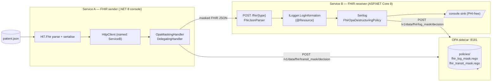
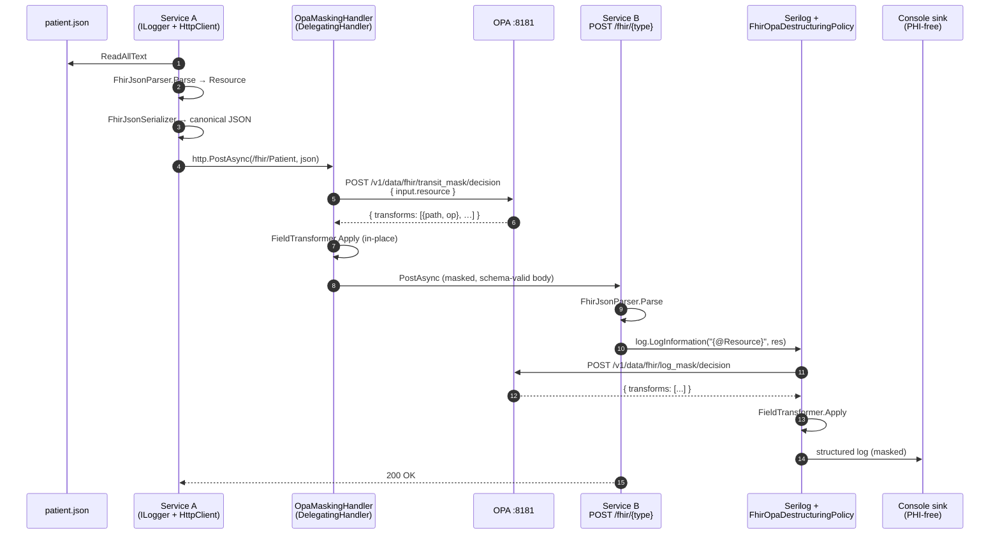
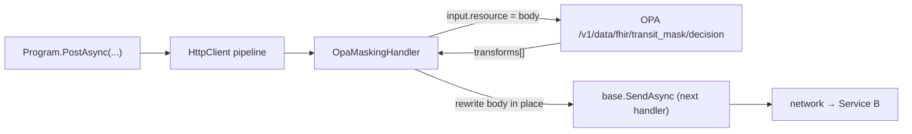

# OPA-driven FHIR log masking — Design

## 1. Purpose

Demonstrate **field-level masking and hashing of HL7 FHIR resources at the
moment they are written to a log**, driven by an externalised policy engine,
in a .NET 8 environment.

The system must satisfy four properties:

1. **No PHI/PII in logs.** A log statement that prints a FHIR `Resource` must
   never emit raw identifiers, names, dates of birth, addresses, etc.
2. **No call-site changes.** Developers keep writing
   `log.LogInformation("...{@Resource}", x)`. They cannot forget to mask.
3. **Policy lives outside the application.** Adding a new sensitive field, or
   a new resource type, must not require recompiling either service.
4. **Independently deployable.** Sender, receiver and policy engine ship as
   three separate units.

---

## 2. Component overview



| Component | Runtime | Source | Responsibility |
|---|---|---|---|
| Service A | .NET 8 console (Generic Host) | `services/ServiceA.FhirSender` | Read a FHIR JSON file, parse with `Hl7.Fhir`, POST canonical FHIR JSON to Service B. The HttpClient pipeline runs `OpaMaskingHandler`, which masks the body before it leaves the process. Logs via `ILogger`. |
| Service B | ASP.NET Core 8 | `services/ServiceB.FhirReceiver` | Receive the resource, log it once. The Serilog destructuring policy calls OPA to mask sensitive fields at log time. |
| Shared.Opa | .NET 8 class library | `services/Shared.Opa` | `OpaClient`, `FieldTransformer`, and the `OpaMaskingHandler` `DelegatingHandler`. Reused by A and B so the same masking logic runs at every chokepoint. |
| OPA | OPA 0.68 (Docker) | `policies/*.rego` | Decide which fields to mask/hash/redact/remove, given the resource and (optionally) caller context. |
| Compose | Docker Desktop | `docker-compose.yml` | Wires the units together with a shared network. |

---

## 3. Data flow for one request



Key properties this flow guarantees:

- **Egress masking (Service A → wire).** `OpaMaskingHandler` rewrites the
  HTTP body before it leaves the process. The `PostAsync` call site is
  unchanged. The transit policy is FHIR-schema-safe (e.g. it removes
  `birthDate` rather than writing `"REDACTED"` into a `date` field).
- **Log-time masking (Service B).** `FhirOpaDestructuringPolicy` runs the
  log-time OPA decision and rewrites the in-memory JSON tree at the moment
  the resource is destructured for logging. The original `Resource` object
  in memory is untouched, so legitimate handlers can still read full PHI.
- **Idempotent.** Both layers apply policies that yield the same result if
  re-applied to an already-masked value. Re-hashing `"***"` or re-removing
  an absent field is a no-op.

Concrete result for the bundled `patient.json`:

| Field | Wire (transit_mask) | Log (log_mask) |
|---|---|---|
| `/identifier/0/value`   | hash   | hash   |
| `/name/0/family`        | hash   | hash   |
| `/name/0/given/0..1`    | mask   | mask   |
| `/telecom/0/value`      | mask (phone) | mask |
| `/telecom/1/value`      | hash (email) | hash |
| `/birthDate`            | **remove** (date is type-strict) | **redact** (`"REDACTED"`) |
| `/address/0/line`       | remove | remove |
| `/address/0/postalCode` | mask   | mask   |

---

## 4. Why this shape

| Decision | Reason |
|---|---|
| OPA out-of-process via HTTP | Canonical OPA deployment. Hot-reloaded policies, language-agnostic, central audit, clear trust boundary. |
| OPA as a localhost / compose-network sidecar | Logging is on the hot path; sub-millisecond RTT keeps the destructuring policy synchronous and acceptable. |
| Decision = list of `{path, op}` JSON Pointers | Decouples *what to protect* (Rego) from *how* (C#). Adding a field or resource type is a Rego edit; adding a new op (`tokenize`, `pseudonymize`, etc.) is a C# edit. They almost never need to change together. |
| Mask at the **log sink boundary** via `IDestructuringPolicy` | One uniform chokepoint. Developers cannot forget. The original object keeps full PHI in memory for legitimate processing; only what *leaves* the process gets transformed. |
| Mask at the **outbound HttpClient boundary** via `DelegatingHandler` | Same idea, applied to network egress. Body is masked transparently in the HTTP pipeline. |
| Two separate policies (transit vs log) | Wire bodies must remain valid FHIR — you cannot put `"REDACTED"` into a `date` field. Logs are plain text and can use the stricter form. Splitting the policy lets each chokepoint use the strongest transform that's still valid for its output. |
| Always serialise to canonical FHIR JSON before showing it to OPA | Policies are written against spec field names (`name[0].family`), not against a service's local variable name. |
| Fail-closed on OPA error | If OPA is unreachable or a transform throws, the log line emits `<Patient: redacted (masking error)>` rather than the raw resource. Better silence than leakage. |
| Compose `profiles: ["sender"]` on Service A | Service A is a one-shot. `compose up` should not keep restarting it. `compose run --rm servicea` is the natural invocation. |

---

## 5. Detailed component design

### 5.1 Service A — FHIR sender

`services/ServiceA.FhirSender/Program.cs`.

- Boots a generic `Host` so DI, configuration and `ILogger` are available.
  Logging is wired through Serilog → console; **no `Console.WriteLine`**.
- Registers the OPA `HttpClient` and the masking handler:

  ```csharp
  services.AddHttpClient<OpaClient>(c => c.BaseAddress = new Uri(opaUrl));
  services.AddTransient(sp => new OpaMaskingHandler(...));
  services.AddHttpClient("ServiceB", c => c.BaseAddress = new Uri(serviceBUrl))
          .AddHttpMessageHandler<OpaMaskingHandler>();
  ```

- Reads the resource path from the first CLI arg (or `SAMPLE_FILE`).
- Parses with `FhirJsonParser`, re-serialises with `FhirJsonSerializer`
  (canonical FHIR JSON on the wire), then `http.PostAsync(...)`.

The `OpaMaskingHandler` middleware in the HTTP pipeline:



- The handler triggers only on JSON request bodies; non-JSON requests pass
  through.
- The OPA `HttpClient` is **not** wrapped by the handler (it's registered
  separately) — otherwise the OPA request itself would recurse.
- `Content-Length` and `Content-Type` are NOT copied from the original
  request body onto the masked body (the new `StringContent` recomputes
  them; copying a stale `Content-Length` causes "content would exceed
  Content-Length" on the wire).
- All logging in Service A is `ILogger<T>` → Serilog → console with a
  named `SourceContext` per class.

### 5.2 Service B — FHIR receiver

`services/ServiceB.FhirReceiver/Program.cs` is intentionally small. The only
"business logic" lines are:

```csharp
builder.Host.UseSerilog((ctx, lc) => lc
    .Destructure.With(new FhirOpaDestructuringPolicy(opaClient, opaPolicy))
    .WriteTo.Console(...));

app.MapPost("/fhir/{resourceType}", async (string resourceType, HttpRequest request, ILogger<Program> log) =>
{
    var resource = parser.Parse<Resource>(await new StreamReader(request.Body).ReadToEndAsync());
    log.LogInformation("Received FHIR resource {@Resource}", resource);
    return Results.Ok(...);
});
```

The OPA integration is encapsulated in three classes:

| File | Role |
|---|---|
| `services/Shared.Opa/OpaClient.cs` | Typed `HttpClient` over OPA's Data API. POST `{ "input": ... }` to `/v1/data/{policyPath}`, parse `result.transforms`. Network/parse failures collapse to an empty decision. |
| `services/Shared.Opa/FieldTransformer.cs` | RFC-6901 JSON Pointer applier. Walks a `JsonNode` tree segment by segment, then performs `mask` / `hash` (SHA-256, first 16 hex) / `redact` / `remove` on the leaf. |
| `services/Shared.Opa/OpaMaskingHandler.cs` | `DelegatingHandler` ("middleware") for outbound `HttpClient`. Used by Service A to mask request bodies before they hit the wire. |
| `services/ServiceB.FhirReceiver/Logging/FhirOpaDestructuringPolicy.cs` | Serilog `IDestructuringPolicy`. Detects `Hl7.Fhir.Model.Resource`, runs the OPA round-trip, converts the masked `JsonNode` to a CLR shape Serilog renders natively. Catches everything and emits a redacted placeholder on failure. |

### 5.3 OPA — the policies

Two policies, one engine:

- `policies/fhir_log_mask.rego` — package `fhir.log_mask`. Aggressive policy
  used at log time. Free to write `"REDACTED"` anywhere because the output
  is plain log text, not FHIR.
- `policies/fhir_transit_mask.rego` — package `fhir.transit_mask`. Used by
  Service A's egress middleware. Conservative — only transforms that yield
  a still-valid FHIR document. For type-strict primitives like `date` it
  uses `remove` instead of `redact`.

Both expose `decision = {"transforms": [...]}` shaped as
`array.concat(...)` of per-resource-type comprehensions. This shape was
chosen instead of partial `contains` rules because OPA 0.68 rejected the
`name contains x if { ... }` syntax in this environment; the comprehension
form loads cleanly without needing `future.keywords.contains`.

Adding a new sensitive field is one comprehension; adding a new resource
type is one comprehension and one entry in `all_transforms`.

### 5.4 Compose

`docker-compose.yml` defines three services:

- `opa` — pulled image, mounts `./policies` read-only. Hot-reloads on file
  changes.
- `serviceb` — built from its Dockerfile, env var
  `Opa__Url=http://opa:8181` resolves the sidecar via Compose DNS.
- `servicea` — built from its Dockerfile, mounts `./sample-data` at `/data`,
  `SERVICE_B_URL=http://serviceb:5002`, `OPA_URL=http://opa:8181`,
  `OPA_POLICY=fhir/transit_mask/decision`. Behind the `sender` profile so
  `compose up` doesn't keep it running; trigger with
  `docker compose run --rm servicea`.

---

## 6. Threat model and limitations

**In-scope guarantees**

- A single `log.Info("{@Resource}", x)` call emits zero raw PHI when the
  resource type is covered by the policy.
- Service A cannot accidentally leak raw PHI via `http.PostAsync` because
  the masking handler runs unconditionally on JSON bodies.
- Adding `address.city` (or any nested field) to the masked set is a Rego-
  only change; redeploy is unnecessary because OPA hot-reloads the mounted
  directory.
- An OPA outage degrades to a redacted placeholder (log path) or to an
  empty decision (transit path), not raw data.

**Out-of-scope / known gaps**

- Raw FHIR JSON written to logs **without** the `@` operator (e.g.
  `log.Info(json)`) bypasses destructuring entirely. This is a code-review
  rule, not a runtime guarantee. Add a Roslyn analyser if you need to
  enforce it.
- Exception messages thrown by `FhirJsonParser` could include partial PHI.
  Wrap `parser.Parse` and sanitise messages before logging.
- The `hash` op is **not a privacy guarantee** — SHA-256 of a 10-digit
  phone number is brute-forceable in milliseconds. Use `hash` only for
  values from a high-entropy domain, or upgrade to keyed HMAC + rotation.
- This demo authenticates nothing. In production, Service B should require
  mTLS or a token, and the OPA `input` should include the verified caller
  identity so the policy can vary by role/purpose.

---

## 7. Is this CNCF OPA?

**Yes.** The Open Policy Agent project is a **graduated CNCF project** (since
February 2021). The exact same project — same source repo, same governance,
same release stream — is what this demo runs.

- **Image:** `docker-compose.yml` pulls `openpolicyagent/opa:0.68.0`, the
  official OPA Docker Hub image.
- **HTTP Data API:** `OpaClient` POSTs to `/v1/data/{policy-path}`, the
  canonical OPA Data API.
- **Policy language:** Rego, OPA's native policy language.

## 8. Operations cheat-sheet

```powershell
# One-shot deploy + run
.\deploy.ps1

# Just resend the patient
.\deploy.ps1 -Action run

# Watch the masked log
.\deploy.ps1 -Action logs

# Edit the policy — OPA hot-reloads
notepad policies\fhir_log_mask.rego
notepad policies\fhir_transit_mask.rego

# Edit the input — bind-mounted, no rebuild
notepad sample-data\patient.json

# Tear down
.\deploy.ps1 -Action down
```
